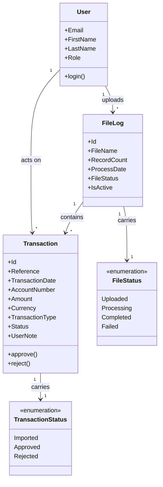

# Requirements: Transaction Import & Approval System

**Domain:** Financial Services — bank transaction file ingestion, review, and approval **Created:** 2026-05-06 **Status:** final **Last finalised at:** 2026-05-06

---

## 1. Application context

**Name:** Transaction Import & Approval System

**Purpose / business value:** Enable an Importer to upload bank-transaction files into the system and an Approver to review, approve, reject, and export the resulting transactions, with a clear file-driven ingestion lifecycle and a per-transaction status flow that gates the available actions.

**Domain:** Financial Services — file-driven bank transaction processing (currency observed in sample data: ZAR; account-number, debit/credit, and transaction-reference conventions consistent with retail banking).

**Business goal:** Reduce manual handling of bank transaction files by giving an importer-side ingestion surface and an approver-side review surface that is gated by transaction status, so every imported transaction reaches a terminal state (Approved or Rejected) with an auditable note when rejected.

---

## 2. Domain model

> The BA's framing of the business domain in **ubiquitous language**, implementation-free.

### 2.1 Concepts

| Concept             | Persistence | Definition (ubiquitous language)                                                                                                |
| ------------------- | ----------- | ------------------------------------------------------------------------------------------------------------------------------- |
| File Log            | persistent  | An uploaded transaction file together with its processing state, source attributes, and record count.                            |
| Transaction         | persistent  | An individual financial record extracted from a File Log, carrying reference, date, account, amount, currency, type, and status. |
| User                | persistent  | An authenticated actor of the system, identified by email and bearing one of the system's roles.                                 |
| Transaction Status  | derived     | The lifecycle position of a Transaction — `Imported`, `Approved`, or `Rejected` — that gates the actions an Approver may take.   |
| File Status         | derived     | The lifecycle position of a File Log — `Uploaded`, `Processing`, `Completed`, or `Failed` — surfaced from the file's last executed processing activity. |

### 2.2 Relationships

- **File Log** *contains* **Transactions** [1 : *]
- **Transaction** *belongs to* **File Log** [* : 1]
- **Transaction** *carries* **Transaction Status** [1 : 1]
- **File Log** *carries* **File Status** [1 : 1]
- **User** *uploads* **File Log** [1 : *] — Importer only
- **User** *acts on* **Transaction** [1 : *] — Approver only

### 2.3 Aggregates & lifecycles

#### File Log

| Field            | Value                                                                                                                                                                  |
| ---------------- | ---------------------------------------------------------------------------------------------------------------------------------------------------------------------- |
| Member concepts  | File Log, Transaction, File Status                                                                                                                                     |
| Lifecycle states | `Uploaded` → `Processing` → `Completed` \| `Failed` — terminal states are `Completed` and `Failed`. Source: stated (PrototypeBriefV2 §6 File States).                 |
| Key invariants   | A File Log must reach a terminal status (`Completed` or `Failed`) before its Transactions are eligible for approval review. A `Failed` File Log surfaces validation errors and may be retried via the retry-validation flow. |

#### Transaction

| Field            | Value                                                                                                                                                                  |
| ---------------- | ---------------------------------------------------------------------------------------------------------------------------------------------------------------------- |
| Member concepts  | Transaction, Transaction Status                                                                                                                                         |
| Lifecycle states | `Imported` → `Approved` \| `Rejected` — terminal states are `Approved` and `Rejected`; once terminal, status does not change. Source: stated (PrototypeBriefV2 §6).    |
| Key invariants   | Approve/Reject are only available while status is `Imported`. A Rejection requires a non-empty Rejection Note. Source: stated (PrototypeBriefV2 §5.7, §6 UI Implications). |

### 2.4 Diagram

---

## 3. Target users

> Target-user personas — the end users of the application being designed.

### Importer

| Field                  | Value                |
| ---------------------- | -------------------- |
| Role / job title       | Operations / file-upload role responsible for getting bank transaction files into the system. |
| Expertise level        | Working knowledge of the bank's file formats and naming conventions; comfortable with file pickers, drag-and-drop, and validation errors. |
| Stakes                 | Low per-action stakes for the upload itself (a re-upload is cheap), but downstream Approvers and reporting depend on the file landing intact. |
| Frequency of use       | Daily — files are typically uploaded on a daily cadence (sample file naming `transactions_2026-04-15.csv` follows a per-day pattern). |
| Driving forces — wants | Confidence the file landed and was parsed cleanly; quick feedback on validation errors; a clear handoff to Approvers. |
| Driving forces — fears | Silently dropped rows; an upload that "looks fine" but failed processing; redoing work because of an unclear status. |

### Approver

| Field                  | Value                |
| ---------------------- | -------------------- |
| Role / job title       | Reviewer with authority to approve or reject individual transactions and to export approved/rejected datasets. |
| Expertise level        | Domain-fluent (knows what a legitimate transaction reference, account, or amount looks like for the bank's portfolio); not a developer. |
| Stakes                 | High per-action stakes — an approval or rejection is a final business decision on each transaction; rejections require a documented note. |
| Frequency of use       | Daily — review cadence aligned to the Importer's daily upload cadence. |
| Driving forces — wants | Fast triage across the day's transactions; confident filtering by status, file, date, amount; one-click approval and a frictionless reject-with-note path. |
| Driving forces — fears | Approving a transaction in error; losing context across many file logs; export missing the active filter. |

---

## 4. User goals & stories

> Quality signals live on the goal (outcome-level), not the story (behaviour-level).

### 4.1 Goals catalogue

| ID    | Goal statement                                                                              | Quality signals                                                                                   | Goal kind         | Layout pref (optional)                                            | UX-pattern pref (optional)                                          |
| ----- | ------------------------------------------------------------------------------------------- | ------------------------------------------------------------------------------------------------- | ----------------- | ----------------------------------------------------------------- | ------------------------------------------------------------------- |
| G-01  | Get a bank transaction file into the system and confirm it imported cleanly.                | Confidence of completion; visibility of record count; explicit success vs failure feedback.       | top-level         | Upload-shell with a per-file detail view                          | Drag-and-drop dropzone with progress, success, and failure states   |
| G-02  | Review the day's imported transactions and act on each one (approve or reject).             | Speed of triage; reversibility (none — terminal); auditability of rejection reason.               | top-level         | Data-table-first working surface                                   | Filterable transactions table with row-level approve/reject actions |
| G-03  | Find a specific transaction or set of transactions by status, file, date, amount, or text.  | Recall (don't miss any matches); precision (filter chips visible); resilience (clearable filters). | sub-level         | Filter rail or filter-bar above the table                          | Status chips + range pickers + free-text search                     |
| G-04  | Export the currently-filtered transactions for downstream reporting.                        | Export reflects the active filter exactly; CSV opens cleanly in spreadsheet tools.                | interaction-level | Action-bar button on the transactions table                        | Single-click export-as-CSV, named after the active filter set       |
| G-05  | See the file-level summary so I can decide which file needs attention next.                 | At-a-glance counts by status; clickable drill-down to that file's transactions.                   | sub-level         | Dashboard-style summary panel above or beside the file-log table  | Status-count cards plus a row-click drill-down                      |
| G-06  | Sign in to the right working surface for my role.                                           | One step; failure feedback that distinguishes credentials from connectivity.                      | top-level         | Single-form login screen                                           | Email + password form with role-based post-login routing            |

### 4.2 Stories by persona

#### Importer

##### Story: As an Importer, I want to upload a transaction file via drag-and-drop, so that I can hand off a day's transactions for approval without re-keying.

| Field                                    | Value                                                                                      |
| ---------------------------------------- | ------------------------------------------------------------------------------------------ |
| Goal                                     | → §4.1 G-01                                                                                |
| Objective                                | Drop a file, fill the FileSetting metadata, confirm the upload, and see processing state.  |
| Context (frequency / expertise / stakes) | Daily; working knowledge of the bank's file conventions; low per-action stakes.            |
| Linked task flow (optional)              | → §5 File Upload                                                                           |

##### Story: As an Importer, I want to see the list of files I have uploaded with their processing state, so that I can spot a Failed file and trigger a retry.

| Field                                    | Value                                                                                                  |
| ---------------------------------------- | ------------------------------------------------------------------------------------------------------ |
| Goal                                     | → §4.1 G-01                                                                                            |
| Objective                                | Scan the file-log dashboard, identify any non-`Completed` files, and act on Failed ones.               |
| Context (frequency / expertise / stakes) | Daily; working knowledge of file conventions; medium stakes if a Failed file is missed.                |
| Linked task flow (optional)              | → §5 File Log Overview, → §5 Retry Validation                                                          |

##### Story: As an Importer, I want a per-file summary of record counts by status, so that I can confirm Approvers have worked through what I uploaded.

| Field                                    | Value                                                                                |
| ---------------------------------------- | ------------------------------------------------------------------------------------ |
| Goal                                     | → §4.1 G-05                                                                          |
| Objective                                | View Imported / Approved / Rejected counts per file and drill down when needed.      |
| Context (frequency / expertise / stakes) | Daily; non-developer; low stakes.                                                    |
| Linked task flow (optional)              | → §5 File Summary                                                                    |

##### Story: As an Importer, I want to sign in once and land on the upload-centric working surface, so that I don't navigate through Approver-only screens.

| Field                                    | Value                                                                |
| ---------------------------------------- | -------------------------------------------------------------------- |
| Goal                                     | → §4.1 G-06                                                          |
| Objective                                | Authenticate with email + password and route to the upload surface.  |
| Context (frequency / expertise / stakes) | Daily; non-developer; low stakes.                                    |
| Linked task flow (optional)              | → §5 Authentication                                                  |

#### Approver

##### Story: As an Approver, I want a filterable table of transactions so that I can triage the day's imports quickly.

| Field                                    | Value                                                                                                |
| ---------------------------------------- | ---------------------------------------------------------------------------------------------------- |
| Goal                                     | → §4.1 G-02                                                                                          |
| Objective                                | Land on the transactions table, narrow by status / file / date / amount / text, and review in order. |
| Context (frequency / expertise / stakes) | Daily; domain-fluent; high per-row stakes.                                                           |
| Linked task flow (optional)              | → §5 Transaction Review, → §5 Search & Filter                                                        |

##### Story: As an Approver, I want to approve a transaction with a single confirmation, so that I can act decisively without ceremony.

| Field                                    | Value                                                                  |
| ---------------------------------------- | ---------------------------------------------------------------------- |
| Goal                                     | → §4.1 G-02                                                            |
| Objective                                | Click approve on a row; confirm; status flips to `Approved` instantly. |
| Context (frequency / expertise / stakes) | Many times per day; domain-fluent; high stakes — irreversible.         |
| Linked task flow (optional)              | → §5 Approve Transaction                                               |

##### Story: As an Approver, I want to reject a transaction and capture the reason, so that the rejection is auditable and the Importer can act on it.

| Field                                    | Value                                                                              |
| ---------------------------------------- | ---------------------------------------------------------------------------------- |
| Goal                                     | → §4.1 G-02                                                                        |
| Objective                                | Click reject; enter a mandatory note; submit; status flips to `Rejected` instantly. |
| Context (frequency / expertise / stakes) | Several times per day; domain-fluent; high stakes — irreversible.                  |
| Linked task flow (optional)              | → §5 Reject Transaction                                                            |

##### Story: As an Approver, I want to filter the transactions table by status, file, date range, amount range, or free text, so that I can find a specific transaction in seconds.

| Field                                    | Value                                                                                |
| ---------------------------------------- | ------------------------------------------------------------------------------------ |
| Goal                                     | → §4.1 G-03                                                                          |
| Objective                                | Combine filters incrementally; see active-filter chips; clear all in one action.     |
| Context (frequency / expertise / stakes) | Many times per day; domain-fluent; medium stakes (a missed match delays approvals).  |
| Linked task flow (optional)              | → §5 Search & Filter                                                                 |

##### Story: As an Approver, I want to export the currently-filtered transactions to CSV, so that I can share an audit-ready dataset with downstream stakeholders.

| Field                                    | Value                                                                                |
| ---------------------------------------- | ------------------------------------------------------------------------------------ |
| Goal                                     | → §4.1 G-04                                                                          |
| Objective                                | Trigger Export; receive a CSV that reflects the current filter set.                  |
| Context (frequency / expertise / stakes) | Daily; domain-fluent; medium stakes (audit/reporting).                               |
| Linked task flow (optional)              | → §5 Export Transactions                                                             |

##### Story: As an Approver, I want a per-file summary of imported / approved / rejected counts, so that I can prioritise the file with the most outstanding `Imported` transactions.

| Field                                    | Value                                                                                |
| ---------------------------------------- | ------------------------------------------------------------------------------------ |
| Goal                                     | → §4.1 G-05                                                                          |
| Objective                                | Read the file-log dashboard; spot pending work; click into the right file.           |
| Context (frequency / expertise / stakes) | Daily; domain-fluent; medium stakes.                                                 |
| Linked task flow (optional)              | → §5 File Summary, → §5 File Log Overview                                            |

##### Story: As an Approver, I want to sign in once and land on the transactions working surface, so that I don't navigate through Importer-only screens.

| Field                                    | Value                                                                |
| ---------------------------------------- | -------------------------------------------------------------------- |
| Goal                                     | → §4.1 G-06                                                          |
| Objective                                | Authenticate with email + password and route to the transactions surface. |
| Context (frequency / expertise / stakes) | Daily; domain-fluent; low stakes.                                    |
| Linked task flow (optional)              | → §5 Authentication                                                  |

---

## 5. Task flows

### Flow: Authentication

| Field                      | Value                                                                                                              |
| -------------------------- | ------------------------------------------------------------------------------------------------------------------ |
| Actor                      | Importer or Approver                                                                                               |
| Trigger                    | User opens the application unauthenticated.                                                                        |
| Steps                      | 1. User enters email and password. 2. Submit. 3. On success, route to the role-specific landing surface (Importer → Upload-centric; Approver → Transactions table). 4. On failure, show an inline error state distinguishing credentials from connectivity. |
| Decision points            | Credentials match → success path. Credentials don't match → error state. Network failure → connectivity error state. |
| Exception paths            | Locked account / forgotten password — present the relevant resolution path.                                         |
| Role-conditional behaviour | Post-login routing differs by role per the §3 personas.                                                            |

### Flow: File Upload

| Field                      | Value                                                                                                                                                                                                                                                                        |
| -------------------------- | ---------------------------------------------------------------------------------------------------------------------------------------------------------------------------------------------------------------------------------------------------------------------------- |
| Actor                      | Importer                                                                                                                                                                                                                                                                     |
| Trigger                    | Importer needs to ingest a new transaction file.                                                                                                                                                                                                                             |
| Steps                      | 1. Importer opens the Upload screen. 2. Selects a file via drag-and-drop or file picker. 3. Provides FileSettingId, FileSettingName, FileName (or these are pre-populated from the chosen FileSetting). 4. Confirms upload. 5. System creates a File Log and starts processing. 6. UI surfaces upload progress and the resulting File Status. |
| Decision points            | File parsed cleanly → File Status `Completed` and Transactions are visible. File has validation errors → File Status `Failed`; show validation error count and offer the retry-validation path.                                                                              |
| Exception paths            | Network failure during upload → resumable error message and a retry control. File rejected by setting (wrong type, wrong source) → inline message naming the FileSetting expectation.                                                                                         |
| Role-conditional behaviour | Importer-only — Approver does not see this flow in navigation.                                                                                                                                                                                                                |

### Flow: File Log Overview

| Field                      | Value                                                                                                                                                                              |
| -------------------------- | ---------------------------------------------------------------------------------------------------------------------------------------------------------------------------------- |
| Actor                      | Importer or Approver                                                                                                                                                                |
| Trigger                    | User wants to see the list of uploaded files and pick one to drill into.                                                                                                            |
| Steps                      | 1. User opens the Dashboard / File Log list. 2. Table renders columns: File Name, Process Date, Record Count, File Status. 3. User clicks a row to drill into that file's transactions. |
| Decision points            | File Status `Completed` → row is clickable to a populated transactions view. File Status `Failed` → row exposes a retry-validation control. File Status `Processing` → row reflects in-progress state. |
| Exception paths            | No files exist → entity-specific empty state ("No file logs yet") with an Upload CTA visible only to Importer per role gating.                                                       |
| Role-conditional behaviour | Both roles read the list. Only Importer sees the Upload CTA on the empty state and the retry-validation control on Failed rows.                                                      |

### Flow: Retry Validation

| Field                      | Value                                                                                                                                       |
| -------------------------- | ------------------------------------------------------------------------------------------------------------------------------------------- |
| Actor                      | Importer                                                                                                                                    |
| Trigger                    | A File Log is in `Failed` status with validation errors.                                                                                    |
| Steps                      | 1. Importer opens the Failed file's detail. 2. Reviews the validation-error rows. 3. Triggers Retry Validation. 4. System re-attempts processing and updates File Status. |
| Decision points            | Re-validation succeeds → File Status transitions to `Completed`. Re-validation fails again → File Status remains `Failed` with updated error rows. |
| Exception paths            | All rows still invalid → no transition; surface the count of unchanged errors.                                                              |
| Role-conditional behaviour | Importer-only — Approver does not see the retry control.                                                                                     |

### Flow: Cancel File

| Field                      | Value                                                                                                                                                                  |
| -------------------------- | ---------------------------------------------------------------------------------------------------------------------------------------------------------------------- |
| Actor                      | Importer                                                                                                                                                               |
| Trigger                    | A File Log was uploaded in error or supersedes a prior upload, and must be removed before its transactions enter the Approver workflow.                                 |
| Steps                      | 1. Importer opens the file's detail. 2. Triggers Cancel. 3. Confirms via a destructive-action gate (modal naming the file, primary action destructive-styled, default focus on Cancel). 4. File Log is deactivated and its Transactions become invisible to the Approver. |
| Decision points            | Confirmation → cancel proceeds. Cancel on a file whose Transactions already include `Approved` rows → blocked with an explanatory banner.                                |
| Exception paths            | Concurrency: File Log already cancelled in another session → idempotent, surface the current state.                                                                      |
| Role-conditional behaviour | Importer-only.                                                                                                                                                          |

### Flow: Transaction Review

| Field                      | Value                                                                                                                                                                                                  |
| -------------------------- | ------------------------------------------------------------------------------------------------------------------------------------------------------------------------------------------------------ |
| Actor                      | Approver (read-only for Importer)                                                                                                                                                                       |
| Trigger                    | Approver wants to act on imported transactions.                                                                                                                                                         |
| Steps                      | 1. Open the Transactions screen (either top-level or via drill-down from a File Log row). 2. Apply filters as needed (Search & Filter flow). 3. Sort columns by single-column ascending/descending. 4. Act on individual rows via Approve / Reject. |
| Decision points            | Row is `Imported` → Approve and Reject row-actions are available. Row is `Approved` or `Rejected` → row-actions are hidden — mutating actions are suppressed on terminal records, with a top-of-page banner naming the state. |
| Exception paths            | Empty result set after filtering → no-results state with active filter chips and a Clear-all action. Empty unfiltered table → entity-specific empty state ("No transactions yet") with the primary creation CTA where applicable. |
| Role-conditional behaviour | Importer sees the table read-only — no row-level Approve/Reject controls. Approver sees the row-actions on `Imported` rows.                                                                              |

### Flow: Search & Filter

| Field                      | Value                                                                                                                                                                                                                                                |
| -------------------------- | ---------------------------------------------------------------------------------------------------------------------------------------------------------------------------------------------------------------------------------------------------- |
| Actor                      | Importer or Approver                                                                                                                                                                                                                                  |
| Trigger                    | User wants to narrow a transactions or file-logs list.                                                                                                                                                                                                |
| Steps                      | 1. User opens the filter controls (filter bar or rail). 2. Selects one or more of: Status (Imported / Approved / Rejected), File (FileLog), Date range, Amount range, free text (Reference, Account). 3. Active filters render as chips with a Clear-all action. |
| Decision points            | Any filter active → filter chips render, Clear-all is enabled. No filters → chips area is empty.                                                                                                                                                       |
| Exception paths            | Zero results from active filters → no-results state, including the active filter chips and Clear-all.                                                                                                                                                  |
| Role-conditional behaviour | Same control set for both roles, applied to whatever list the user is on. Status filter is visible to both.                                                                                                                                            |

### Flow: Approve Transaction

| Field                      | Value                                                                                                                                       |
| -------------------------- | ------------------------------------------------------------------------------------------------------------------------------------------- |
| Actor                      | Approver                                                                                                                                    |
| Trigger                    | Approver decides a Transaction is valid.                                                                                                    |
| Steps                      | 1. Approver clicks Approve on an `Imported` row. 2. Confirmation modal appears, naming the transaction reference (destructive-styled primary; default focus on Cancel). 3. Approver confirms. 4. Status flips to `Approved`; row updates instantly; toast confirmation (auto-dismiss 4–8 s, top-right). |
| Decision points            | Row is `Imported` → action allowed. Row is not `Imported` → action is hidden (terminal status; see Transaction Review).                       |
| Exception paths            | On Approve, if a concurrent change has already moved the row out of Imported, the modal is dismissed with a banner explaining the new state.  |
| Role-conditional behaviour | Approver-only. Importer never sees Approve.                                                                                                  |

### Flow: Reject Transaction

| Field                      | Value                                                                                                                                                                                                          |
| -------------------------- | -------------------------------------------------------------------------------------------------------------------------------------------------------------------------------------------------------------- |
| Actor                      | Approver                                                                                                                                                                                                       |
| Trigger                    | Approver decides a Transaction is invalid or needs Importer attention.                                                                                                                                          |
| Steps                      | 1. Approver clicks Reject on an `Imported` row. 2. Modal opens with a mandatory Rejection Note text field. 3. Approver enters a non-empty note. 4. Submit. 5. Status flips to `Rejected`; row updates instantly; toast confirmation (auto-dismiss 4–8 s, top-right). |
| Decision points            | Row is `Imported` → action allowed. Row is not `Imported` → action is hidden. Note empty → submit disabled until a note is entered (validate on blur and on submit).                                            |
| Exception paths            | Concurrent change → modal dismissed with a banner. Note exceeds maximum length → inline validation error.                                                                                                       |
| Role-conditional behaviour | Approver-only.                                                                                                                                                                                                  |

### Flow: Export Transactions

| Field                      | Value                                                                                                                                                                                |
| -------------------------- | ------------------------------------------------------------------------------------------------------------------------------------------------------------------------------------ |
| Actor                      | Approver                                                                                                                                                                              |
| Trigger                    | Approver wants to share or archive the currently-filtered transactions.                                                                                                                |
| Steps                      | 1. Approver clicks Export on the Transactions toolbar. 2. CSV is generated client-side from the active filtered set. 3. File downloads with a name reflecting the active filter and date. |
| Decision points            | Filter active → export reflects the filter exactly. No filter → export reflects the full visible dataset.                                                                              |
| Exception paths            | Zero rows in the current filter → Export is disabled with tooltip explanation.                                                                                                         |
| Role-conditional behaviour | Approver-only — Importer does not see Export.                                                                                                                                          |

### Flow: File Summary

| Field                      | Value                                                                                                                                                                                                                  |
| -------------------------- | ---------------------------------------------------------------------------------------------------------------------------------------------------------------------------------------------------------------------- |
| Actor                      | Importer or Approver                                                                                                                                                                                                    |
| Trigger                    | User wants per-file totals: Total records and counts by status (Imported / Approved / Rejected).                                                                                                                         |
| Steps                      | 1. User opens a File Log's detail (drill-down from the File Log Overview). 2. Summary panel renders Total records, Imported count, Approved count, Rejected count. 3. Clicking a count drills into that filtered slice of the Transactions table. |
| Decision points            | All Transactions are terminal (no `Imported` left) → file is "fully reviewed" and the summary shows the completion state.                                                                                                |
| Exception paths            | File Log in `Failed` status → summary panel shows a banner pointing to the validation-errors view; counts may be partial.                                                                                                 |
| Role-conditional behaviour | Both roles see the summary. Only Approver sees row-actions on the drill-down's Imported rows.                                                                                                                            |

---

## 6. Requirements

### 6.1 Functional

- F-01 The system supports email-and-password authentication and routes the user to a role-specific landing surface on success. Source: stated (PrototypeBriefV2 §5.1).
- F-02 The system accepts file uploads for Importers via drag-and-drop or file picker, with mandatory FileSettingId, FileSettingName, and FileName attributes. Source: stated (PrototypeBriefV2 §5.2; openapi `/v1/files/upload`).
- F-03 The system creates a File Log per upload and surfaces upload progress, success, or failure feedback in the UI. Source: stated (PrototypeBriefV2 §5.2).
- F-04 The system lists File Logs in a table with File Name, Process Date, Record Count, and File Status columns; rows drill into that file's transactions. Source: stated (PrototypeBriefV2 §5.3).
- F-05 The system lists Transactions in a table with Reference, Date, Account, Amount, Currency, and Status columns. Source: stated (PrototypeBriefV2 §5.4).
- F-06 The system supports filtering Transactions by Status (Imported / Approved / Rejected), File (FileLogId), Date range, Amount range, and free-text search on Reference and Account. Source: stated (PrototypeBriefV2 §5.5).
- F-07 The system supports filtering File Logs by status, file name, and process date range.
- F-08 An Approver may approve a Transaction in `Imported` status, transitioning it to `Approved`. Source: stated (PrototypeBriefV2 §5.6; openapi `/v1/transactions/approve`).
- F-09 An Approver may reject a Transaction in `Imported` status by submitting a non-empty Rejection Note, transitioning it to `Rejected`. Source: stated (PrototypeBriefV2 §5.7; openapi `/v1/transactions/reject`).
- F-10 An Approver may export the currently-filtered Transactions as CSV. Source: stated (PrototypeBriefV2 §5.8).
- F-11 The system surfaces a per-File Summary view: Total records, Imported count, Approved count, Rejected count. Source: stated (PrototypeBriefV2 §5.9).
- F-12 An Importer may retry validation on a `Failed` File Log. Source: stated (openapi `/v1/files/retry-validation`).
- F-13 An Importer may cancel a File Log, deactivating it and removing its Transactions from the Approver's working surface. Source: stated (openapi `/v1/files`, DELETE).
- F-14 The system surfaces validation errors on a `Failed` File Log as a list of invalid rows with column metadata. Source: stated (openapi `/v1/files/validation-errors`, `/v1/files/validation-errors/columns`).
- F-15 The system displays Transactions in a sortable, paginated table (rows-per-page 5 / 10 / 20 / 50, default 20; single-column sort).
- F-16 The system displays File Logs in a sortable, paginated table (rows-per-page 5 / 10 / 20 / 50, default 20; single-column sort).

### 6.2 Business rules

| ID    | Statement (when / then)                                                                                                                                                          | Enforcement point | Source                                          | Severity |
| ----- | -------------------------------------------------------------------------------------------------------------------------------------------------------------------------------- | ----------------- | ----------------------------------------------- | -------- |
| BR-01 | When a Transaction's Status is not `Imported`, then the Approve and Reject row-actions must be hidden in the UI.                                                                  | UI                | → §2.3 Transaction invariant; → §6.1 F-08, F-09 | blocker  |
| BR-02 | When an Approver attempts to reject a Transaction, then a non-empty Rejection Note must be submitted; the submit control is disabled until a note is entered.                     | UI                | → §2.3 Transaction invariant; → §6.1 F-09       | blocker  |
| BR-03 | When an Approver attempts to approve or reject a Transaction, then a confirmation modal naming the transaction reference must be shown before the status change is committed.    | UI                | → §6.1 F-08, F-09; standard practice             | blocker  |
| BR-04 | When a File Log's File Status is `Processing` or `Uploaded`, then the row's drill-down to its Transactions must indicate work-in-progress and the Transactions table must surface a banner that the dataset is not yet final. | UI                | → §2.3 File Log invariant                       | major    |
| BR-05 | When a File Log is in `Failed` status, then the file detail must surface the validation-errors view and the retry-validation control (Importer-only).                            | UI                | → §6.1 F-12, F-14                               | major    |
| BR-06 | When the Approver triggers Export, then the export's row-set must equal the currently-applied filter set on the Transactions table.                                              | UI                | → §6.1 F-10                                     | blocker  |
| BR-07 | When a File Log has at least one `Approved` Transaction, then the Cancel-File action must be blocked with an explanatory banner.                                                  | UI                | → §6.1 F-13                                     | major    |
| BR-08 | When a Transaction's Status is `Rejected`, then its Rejection Note must be visible on the Transaction's detail (read-only after the rejection is committed).                     | UI                | → §2.3 Transaction invariant; → §6.1 F-09       | major    |

### 6.3 Data

- The Transaction record carries the fields enumerated on the §7 Transaction entity. Source: stated (openapi `TransactionRead` schema; PrototypeBriefV2 §2; sample CSV `transactions_2026-04-15.csv`).
- The File Log record carries the fields enumerated on the §7 FileLog entity. Source: stated (openapi `FileLog` schema; PrototypeBriefV2 §2).
- Transaction Status enum values are exactly `Imported`, `Approved`, `Rejected`. Source: stated (PrototypeBriefV2 §6).
- File Status enum values are exactly `Uploaded`, `Processing`, `Completed`, `Failed`. Source: stated (PrototypeBriefV2 §6 File States).
- TransactionType is a single-character code: `C` for Credit, `D` for Debit, observed in `transactions_2026-04-15.csv`. Sample data also shows decimal amounts up to 2dp with ZAR currency. Source: stated.
- Reference format observed in sample data: `TXN-YYYYMMDD-NNNN`.
- AccountNumber format observed in sample data: 4-4-4 hyphenated digit groups (e.g. `1001-2034-5567`).
- Currencies in scope for the prototype: ZAR (the sole currency in the sample data).

### 6.4 User-facing

- UF-01 The Transactions table renders the columns Reference, Transaction Date, Account, Description, Amount, Currency, Transaction Type, Status, with row-level Approve and Reject actions for the Approver only on `Imported` rows. Source: stated (PrototypeBriefV2 §5.4; openapi `TransactionRead`).
- UF-02 The File Logs table renders the columns File Name, Process Date, Record Count, Status, and supports row-click drill-down. Source: stated (PrototypeBriefV2 §5.3).
- UF-03 The Reject modal displays a mandatory Rejection Note text field (multi-line) with a character counter and a clear character ceiling.
- UF-04 The Upload screen presents a drag-and-drop dropzone, a file picker fallback, an upload progress state, and explicit success / failure feedback states. Source: stated (PrototypeBriefV2 §5.2 Prototype screens).
- UF-05 Forms validate on blur for synchronous rules (format, required, length) and on submit for cross-field and asynchronous rules (uniqueness, server-side checks); they never validate on keystroke.
- UF-06 Required form fields are marked with a leading asterisk and a single legend line above the form (or, when ≥80 % of fields are required, optional fields are marked "(optional)" instead). The first editable field on a form is autofocused on open, except where a destructive or navigational confirmation step precedes the form (in which case the primary cancel/back holds focus).
- UF-07 Empty states distinguish zero-data ("No file logs yet" / "No transactions yet" with the primary creation CTA) from zero-results-of-filter (active filter chips, Clear-all action, no creation CTA).
- UF-08 Tables use the pagination ladder 5 / 10 / 20 / 50 (default 20). The pagination control, including the rows-per-page selector, is always rendered (page-navigation controls are disabled but visible when the dataset is smaller than the current page size). All columns are sortable; sorting is single-column, ascending on first click and descending on second; the active sort column is indicated in the header and persists for the session.
- UF-09 Status badges colour-map: `Imported` (in-progress / blue), `Approved` (success / green), `Rejected` (error / red); `Completed` (success / green), `Failed` (error / red), `Processing` (in-progress / blue), `Uploaded` (info / blue or neutral / grey). Colour is always paired with an icon or text label; never relied on alone.
- UF-10 Toasts (auto-dismiss 4–8 s, top-right) confirm completed Approve and Reject actions; banners (persistent, top of page or section) are used for permission-denied, archived-file, and validation-error states.
- UF-11 Notification or pending-work counts on tabs and nav items display exact counts up to 99, "99+" for higher counts, and hide the badge entirely for counts of 0.
- UF-12 Icon-only row actions (Approve / Reject) carry tooltips on hover and focus plus an `aria-label` matching the tooltip text; primary destructive actions are never icon-only.
- UF-13 Tables collapse to vertical card lists below 768 px, showing the primary identifier, 2–3 key columns, and a row-action overflow; desktop tables are not horizontally scrolled on mobile.
- UF-14 Top-level navigation: Dashboard (File Logs), Transactions, Upload (Importer-only). Source: stated (PrototypeBriefV2 §7).

### 6.5 Access control (RBAC)

> Roles-×-resources matrix. Cell values use the action vocabulary below; blanks mean "no access".

**Action vocabulary:** `C` create · `R` read · `U` update · `D` delete · `X` execute / invoke · `A` approve · `—` no access. Suffix with a BR ref for conditional access (e.g. `U†BR-07` = update gated by BR-07).

| Role (→ §3) | FileLog (entity) | Transaction (entity) | User (entity) | Authentication (flow) | File Upload (flow) | File Log Overview (flow) | Retry Validation (flow) | Cancel File (flow) | Transaction Review (flow) | Search & Filter (flow) | Approve Transaction (flow) | Reject Transaction (flow) | Export Transactions (flow) | File Summary (flow) |
| ----------- | ---------------- | -------------------- | ------------- | --------------------- | ------------------ | ------------------------ | ----------------------- | ------------------ | ------------------------- | ---------------------- | -------------------------- | ------------------------- | -------------------------- | ------------------- |
| Importer    | C R              | R                    | R (self)      | X                     | X                  | R                        | X                       | X†BR-07            | R                         | X                      | —                          | —                         | —                          | R                   |
| Approver    | R                | R U†BR-01            | R (self)      | X                     | —                  | R                        | —                       | —                  | R                         | X                      | A†BR-01                    | A†BR-01,BR-02             | X                          | R                   |

> Notes:
> - `Importer` cannot Approve/Reject (`—` per stated brief). Denied actions must be hidden in the UI, not rendered as disabled controls.
> - `Approver` cannot Upload, Retry, or Cancel a file (`—` per stated brief). Denied actions are hidden.
> - Direct-link access by a denied persona surfaces an in-page permission-denied banner naming the missing permission and pointing to a contact or request-access path; a generic 403 error page is not used.
> - `Transaction U†BR-01` reflects that an Approver's mutation is restricted to the Status field, gated by BR-01 (must be `Imported`).

### 6.6 Non-functional

> NFRs are first-class even when inferred — domain heuristics drive defaults (financial services ≠ marketing site).

#### 6.6.1 Security & session

| Field                    | Value                                                                            | Source            |
| ------------------------ | -------------------------------------------------------------------------------- | ----------------- |
| Idle session timeout     | 15 minutes — financial-services default                                          | inferred          |
| Absolute session timeout | 8 hours — financial-services default                                             | inferred          |
| Idle warning lead-time   | 60 seconds — financial-services default                                          | inferred          |
| Re-auth scope            | Step-up auth required for approve-class actions (Approve, Reject, Export, Cancel-File) | inferred  |
| Account lockout policy   | 5 failed attempts → 15-minute cooldown                                           | inferred          |
| MFA requirement          | Required for Approver, optional for Importer                                     | inferred          |

#### 6.6.2 Performance

| Metric                                        | Target                              | Source            |
| --------------------------------------------- | ----------------------------------- | ----------------- |
| Page TTI (Transactions table, 100 rows)       | p95 ≤ 2 s                           | inferred          |
| API p99 latency (read endpoints)              | ≤ 1 s                               | inferred          |
| File-upload completion (≤ 5 MB CSV)           | ≤ 30 s                              | inferred          |

#### 6.6.3 Availability

| Field              | Value                                                | Source            |
| ------------------ | ---------------------------------------------------- | ----------------- |
| Target uptime      | 99.5 % business-hours                                | inferred          |
| Maintenance window | Off-hours, scheduled                                 | inferred          |
| RTO / RPO          | RTO 4 h / RPO 1 h                                    | inferred          |

#### 6.6.4 Compliance & audit

- Compliance regimes: POPIA (South African Protection of Personal Information Act — inferred from ZAR currency and ZA-style account numbering); audit-log retention and data-residency policies are infrastructure-side.
- Visible-in-UI compliance touchpoints: PII redaction on customer-facing screens is not in prototype scope (the system surfaces account numbers and amounts to the operator personas only).

#### 6.6.5 Accessibility

- Target: WCAG 2.2 AA. Status badges pair colour with icon and text; icon-only controls have tooltips and `aria-label`; tables collapse on mobile. Keyboard-first operation across all primary flows.

---

## 7. Data entities

> Implementation-prep view: storage shape, types, validations, FK plumbing.

### Entity: FileLog

| Field                     | Type    | Required | Validation                                  | Notes                                                                                       |
| ------------------------- | ------- | -------- | ------------------------------------------- | ------------------------------------------------------------------------------------------- |
| Id                        | integer | yes      | system-assigned                             | Internal identifier.                                                                        |
| FileName                  | string  | yes      | non-empty; max 255 chars                    | Displayed in the File Log Overview table.                                                   |
| RecordCount               | string  | yes      | numeric                                     | Total transactions parsed from the file. Displayed in the File Log Overview table.         |
| LastExecutedActivityName  | string  | yes      | enum-like (process activity)                | Drives the derived File Status displayed in the table. Source: stated (PrototypeBriefV2 §2). |
| FileStatus (derived)      | enum    | yes      | one of `Uploaded`, `Processing`, `Completed`, `Failed` | Displayed as a status badge.                                                       |
| ProcessDate               | datetime | yes     | ISO-8601                                     | Displayed as the file's process date column.                                                |
| IsActive                  | boolean | yes      | true / false                                | A cancelled file flips IsActive to false; UI hides cancelled files unless explicitly shown. |
| SettingId                 | integer | yes      | FK to FileSetting                           | Internal reference.                                                                          |
| SettingName               | string  | yes      | mirrors FileSetting.Name                    | Displayed in the upload confirmation and on file detail.                                    |

**Domain concept:** File Log

**Relationships:** FileLog 1 → * Transaction (1-to-many; storage view of §2.2 "File Log contains Transactions")

**Enums:** `FileStatus` ∈ { `Uploaded`, `Processing`, `Completed`, `Failed` }

### Entity: Transaction

| Field            | Type    | Required | Validation                                                                                  | Notes                                                                            |
| ---------------- | ------- | -------- | ------------------------------------------------------------------------------------------- | -------------------------------------------------------------------------------- |
| Id               | integer | yes      | system-assigned                                                                             | Internal identifier.                                                              |
| FileLogId        | integer | yes      | FK to FileLog                                                                               | Internal reference.                                                               |
| FileName         | string  | yes      | mirrors FileLog.FileName                                                                    | Useful for display when a Transaction is shown outside its file context.         |
| Reference        | string  | yes      | non-empty; format `TXN-YYYYMMDD-NNNN`                                                        | Displayed as the primary identifier in the table.                                |
| TransactionDate  | datetime | yes     | ISO-8601 or `YYYY/MM/DD HH:MM` (sample-data form)                                           | Displayed as a date column; sortable.                                            |
| AccountNumber    | string  | yes      | non-empty; sample-data form 4-4-4 hyphenated digit groups                                    | Displayed as a column.                                                           |
| Description      | string  | no       | max 255 chars                                                                                | Displayed as a column when space allows; collapses to overflow on small screens. |
| Amount           | number  | yes      | non-negative; up to 2 decimal places                                                        | Displayed right-aligned in the table.                                            |
| Currency         | string  | yes      | ISO-4217 3-letter code; ZAR is the in-scope currency for the prototype                      | Displayed as a column.                                                           |
| TransactionType  | enum    | yes      | one of `C` (Credit), `D` (Debit)                                                            | Displayed as a column or as part of the Amount cell.                             |
| Status           | enum    | yes      | one of `Imported`, `Approved`, `Rejected`                                                   | Displayed as a status badge.                                                      |
| UserNote         | string  | no       | required when Status is `Rejected`; max 500 chars                                            | Displayed on the Transaction detail; captured via the Reject modal.              |
| LastChangedUser  | string  | yes      | mirrors current User                                                                        | Audit field.                                                                       |
| LastChangedDate  | datetime | yes     | system-assigned                                                                             | Audit field.                                                                       |

**Domain concept:** Transaction

**Relationships:** Transaction * → 1 FileLog (storage view of §2.2 "Transaction belongs to File Log")

**Enums:** `Status` ∈ { `Imported`, `Approved`, `Rejected` }; `TransactionType` ∈ { `C`, `D` }

### Entity: User

| Field           | Type    | Required | Validation                              | Notes                                                                           |
| --------------- | ------- | -------- | --------------------------------------- | ------------------------------------------------------------------------------- |
| Id              | integer | yes      | system-assigned                         | Internal identifier.                                                             |
| Email           | string  | yes      | RFC-5322 email format                   | Used as the login identifier.                                                   |
| FirstName       | string  | yes      | non-empty; max 64 chars                 | Displayed in the user-greeting and on user-detail screens.                       |
| LastName        | string  | yes      | non-empty; max 64 chars                 | Displayed in the user-greeting and on user-detail screens.                       |
| Password        | string  | yes      | minimum complexity per the org's policy | Never displayed; write-only on Create/Update.                                  |
| Role            | enum    | yes      | one of `Importer`, `Approver`           | Drives post-login routing and the RBAC matrix.                                |

**Domain concept:** User

**Relationships:** User 1 → * FileLog (Importer uploads); User 1 → * Transaction (Approver acts on)

**Enums:** `Role` ∈ { `Importer`, `Approver` }

---

## 8. Source UI references

| Reference            | Location                                                                          | Notes                                                                                                              |
| -------------------- | --------------------------------------------------------------------------------- | ------------------------------------------------------------------------------------------------------------------ |
| Prototype Brief V2   | `input/PrototypeBriefV2.md`                                                       | Sections 1–8 — objective, domain model, roles, flows, states, navigation, key screens. Authoritative for stated UI. |
| Transaction API      | `input/openapi.json`                                                              | OpenAPI 3.0.1 spec for the TransactionManagement service; authoritative for entity fields and endpoints.            |
| Sample transactions  | `input/transactions_2026-04-15.csv`                                               | 20 transaction rows for one account on one day; authoritative for Reference, Account, Amount, and Currency formats. |

---

## 9. Key terminology

> Domain-concept definitions or non-domain-concept terms (process, role, UI).

| Term                | Definition                                                                                                                                | Inconsistency flag                                                                |
| ------------------- | ----------------------------------------------------------------------------------------------------------------------------------------- | --------------------------------------------------------------------------------- |
| File Log            | An uploaded file with its processing state. → §2.1.                                                                                       | Inputs use both "File Log" and "FileLog"; treat as the same concept.              |
| Transaction         | An individual financial record extracted from a File Log. → §2.1.                                                                          | —                                                                                 |
| Importer            | The role that uploads files and views results. → §3.                                                                                      | —                                                                                 |
| Approver            | The role that reviews transactions and approves, rejects, or exports them. → §3.                                                          | —                                                                                 |
| Imported (status)   | A Transaction's initial status — eligible for Approver action.                                                                             | —                                                                                 |
| Approved (status)   | A Transaction terminal status — committed.                                                                                                 | —                                                                                 |
| Rejected (status)   | A Transaction terminal status — committed with a Rejection Note.                                                                           | —                                                                                 |
| File Status         | Derived state of a File Log: `Uploaded`, `Processing`, `Completed`, `Failed`. Surfaced from `LastExecutedActivityName` per the API.        | Brief §6 marks file states as inferred; openapi `FileLog.CurrentStatus` carries the same role. Treat as a single derived field. |
| Rejection Note      | The free-text reason captured at rejection time, stored on Transaction.UserNote.                                                            | API uses `UserNote`; UI surfaces it as "Rejection Note" — treat the term-pair as synonymous. |
| FileSetting         | The configuration that governs how a file is parsed (StagingTable, Direction, ProcessDefinition, etc.). Surfaced at upload time.            | Out of scope for the prototype — the user picks an existing setting; setting CRUD is not a prototype flow. |
| Cancel (file)       | Deactivating a File Log so its Transactions are removed from the Approver's working surface.                                                 | API uses `DELETE /v1/files`; UI calls it "Cancel" rather than "Delete" because the brief frames the action as removal-from-workflow. |

---

## 10. Volumes

| Metric      | Value                                                                                                  | Source                                                                |
| ----------- | ------------------------------------------------------------------------------------------------------ | --------------------------------------------------------------------- |
| Data volume | 10²–10⁴ transactions per uploaded file; cumulative file logs in the low thousands per year.            | inferred (sample CSV is 20 rows for one day; daily upload cadence)    |
| Frequency   | Daily file uploads per FileSetting; multiple Approve / Reject actions per minute during peak review.   | inferred (filename pattern `transactions_YYYY-MM-DD.csv` implies daily) |
| Concurrency | 1–10 concurrent Approvers; 1–5 concurrent Importers; small operations team.                            | inferred (operations-team scale, financial-services back-office)        |

---

## Prototype invariants

### PI-01 — Server behaviour is simulated

All server-side behaviour — authentication, API calls, database operations, third-party integrations, scheduled jobs — is simulated by client-side stubs. Backend-shaped requirements describe the user-visible behaviour the simulation must reproduce, not real implementation. Endpoints, middleware, message queues, and infrastructure are out of scope.

### PI-02 — Data is fixture-backed

All data displayed in the prototype is sourced from in-memory fixtures shipped with the build. Mutations persist within a session but do not survive a reload unless an explicit "demo data" mode is specified. There is no real database, no migrations, and no data import / export pipelines.

### PI-03 — Validation is visual only

Form-field validation messages and inline error feedback are rendered as specified by the requirements, but no server-side enforcement is exercised. Constraints that are not visible in the UI — uniqueness checks, referential integrity, rate limiting, idempotency — are not run, even when the requirements name them.

### PI-04 — Third-party integrations are visual

Email, SMS, payment, mapping, file storage, and analytics integrations appear in the UI as visual confirmations or placeholder content. No external network calls are made. Where the requirements describe a third-party flow, the prototype reproduces the user-visible steps and the resulting UI state, not the network exchange.

### PI-05 — Role switcher

Every screen accessible to more than one role displays a role switcher in the prototype's surrounding chrome — outside the application UI under design — so reviewers can inspect each role's view without re-authenticating. The switcher is clearly labelled as a prototype tool, not an in-app control, and is placed in the same position on every screen. It lists every role defined in §3 of the requirements; roles to whom the active screen is not accessible per §6.5 RBAC are rendered in a disabled state. Switching the active role must immediately update the screen's visible components and actions to match the rules captured in the requirements (RBAC entries, conditional visibility, role-gated actions).
